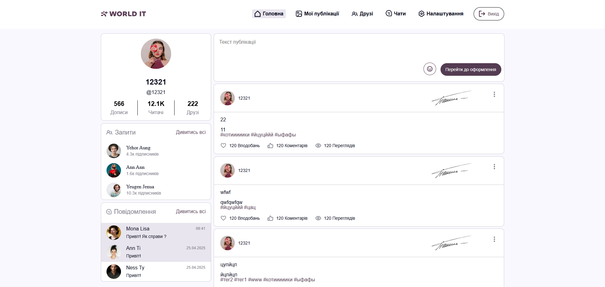
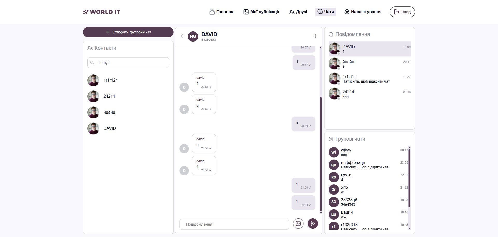
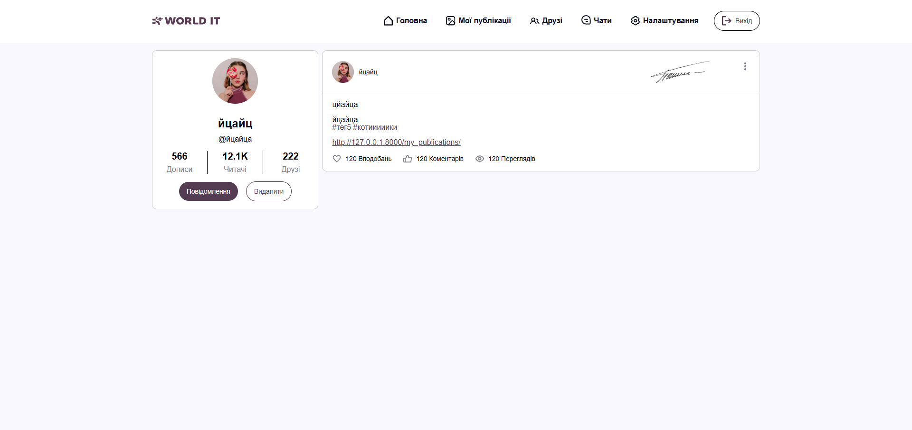

# 🌐 SOCIAL NETWORK


## 🚀 Django Social Network Project

**A full-stack social network built with Django, WebSockets and modern
web technologies**
:::

------------------------------------------------------------------------

# 🇺🇦 Українська версія

## 1. 🎯 Мета створення проєкту

Метою створення цього проєкту було розробити повноцінну соціальну мережу
та отримати практичний досвід командної розробки.

Проєкт допомагає початківцям краще зрозуміти: - як створюються сучасні
веб-застосунки; - як працює backend та frontend взаємодія; - як
організовується робота в команді; - як створювати реальні проєкти з
використанням Django.

------------------------------------------------------------------------

# 2. 👥 Склад команди

### Святослав Немикін (Sviatoslav Nemykin) --- Team Lead

GitHub: https://github.com/SviatoslavNemykin

### Артем Греков (Artyom Hrekov)

GitHub: https://github.com/Artyom-Grekov

### Давид Чеверда (Davyd Cheverda)

GitHub: https://github.com/Zixtherc

### Ніка Макарчук (Nika Makarchuk)

GitHub: https://github.com/tayewatawayo

------------------------------------------------------------------------

# 3. 📌 Зміст файлу

-   🎯 Мета проєкту
-   👥 Команда
-   🛠 Технології
-   ⚙️ Запуск проєкту
-   📂 Структура проєкту
-   🖼 Опис додатків
-   ✅ Висновок

------------------------------------------------------------------------

# 4. 🛠 Модулі та технології

## Технології:

-   Python
-   Django
-   HTML5
-   CSS3
-   JavaScript
-   Daphne
-   WebSocket
-   SQLite

## Використані Django додатки:

-   chats_app
-   friends_app
-   home_app
-   my_publications
-   user_app

------------------------------------------------------------------------

# 5. ⚙️ Як запустити проєкт

### 1. Клонувати репозиторій:

``` bash
git clone https://github.com/SviatoslavNemykin/Social-network.git
```

### 2. Створити віртуальне середовище:

Windows:

``` bash
python -m venv venv
venv\Scripts\activate
```

Linux / Mac:

``` bash
python3 -m venv venv
source venv/bin/activate
```

### 3. Встановити залежності:

``` bash
pip install -r requirements.txt
```
### 4. Перейти у папку проєкту:

``` bash
cd social_network
```

### 5. Виконати міграції:

``` bash
python manage.py migrate
```

### 6. Запустити сервер:

``` bash
python manage.py runserver
```

------------------------------------------------------------------------

# 6. 📂 Зміст проєкту

## chats_app 💬

Відповідає за: - систему чатів; - повідомлення; - онлайн статус
користувачів; - WebSocket взаємодію.

## friends_app 👥

Відповідає за: - додавання друзів; - видалення друзів; - керування
списком друзів.

## home_app 🏠

Головна сторінка проєкту.

## my_publications 📝

Відповідає за: - створення постів; - перегляд публікацій; - роботу зі
стрічкою.

## user_app 👤

Відповідає за: - реєстрацію; - авторизацію; - профіль користувача; -
налаштування акаунта.

------------------------------------------------------------------------

# 🖼 Зображення проєкту





------------------------------------------------------------------------

# 7. ✅ Висновок

Цей проєкт був дуже корисним для нашої команди.

Ми навчилися: - працювати разом над великим проєктом; - правильно
розподіляти задачі; - створювати повноцінні веб-додатки; -
використовувати сучасні технології розробки.

У майбутньому проєкт можна розвивати додаванням: - нових функцій
соціальної мережі; - системи лайків; - коментарів; - покращення
дизайну; - мобільної версії.

------------------------------------------------------------------------


# 🇬🇧 English Version

# 1. 🎯 Project Goal

The goal of this project was to create a full-featured social network
and gain practical experience in team development.

The project helps beginners understand: - how modern web applications
are created; - frontend and backend interaction; - teamwork
organization; - building real-world Django projects.

------------------------------------------------------------------------

# 2. 👥 Team Members

### Sviatoslav Nemykin --- Team Lead

GitHub: https://github.com/SviatoslavNemykin

### Artyom Hrekov

GitHub: https://github.com/Artyom-Grekov

### Davyd Cheverda

GitHub: https://github.com/Zixtherc

### Nika Makarchuk

GitHub: https://github.com/tayewatawayo

------------------------------------------------------------------------

# 3. 📌 File Navigation

-   Project Goal
-   Team Members
-   Technologies
-   Running Instructions
-   Project Structure
-   Applications Description
-   Conclusion

------------------------------------------------------------------------

# 4. 🛠 Technologies

Used technologies:

-   Python
-   Django
-   HTML5
-   CSS3
-   JavaScript
-   Daphne
-   WebSocket
-   SQLite

------------------------------------------------------------------------

# 5. ⚙️ How to Run

### 1. Clone the repository:

``` bash
git clone https://github.com/SviatoslavNemykin/Social-network.git
```

### 2. Create a virtual environment:

Windows:

``` bash
python -m venv venv
venv\Scripts\activate
```

Linux / Mac:

``` bash
python3 -m venv venv
source venv/bin/activate
```

### 3. Install dependencies:

``` bash
pip install -r requirements.txt
```
### 4. Go to the project folder:

``` bash
cd social_network
```

### 5. Run migrations:

``` bash
python manage.py migrate
```

### 6. Start the server:

``` bash
python manage.py runserver
```


------------------------------------------------------------------------

# 6. 📂 Project Overview

## chats_app

Responsible for: - chats; - messages; - online status; - WebSocket
communication.

## friends_app

Responsible for: - adding friends; - removing friends; - friend
management.

## home_app

Main project page.

## my_publications

Responsible for: - creating posts; - viewing publications; - user feed.

## user_app

Responsible for: - registration; - authentication; - user profiles; -
settings.

------------------------------------------------------------------------

# 🖼 Project Images


------------------------------------------------------------------------

# 7. ✅ Conclusion

This project was very valuable for our team.

We learned: - teamwork on a large project; - task distribution; -
creating full-stack applications; - using modern development
technologies.

Future improvements: - new social network features; - likes; -
comments; - improved design; - mobile application.

------------------------------------------------------------------------

⭐ Thanks for checking our project!
